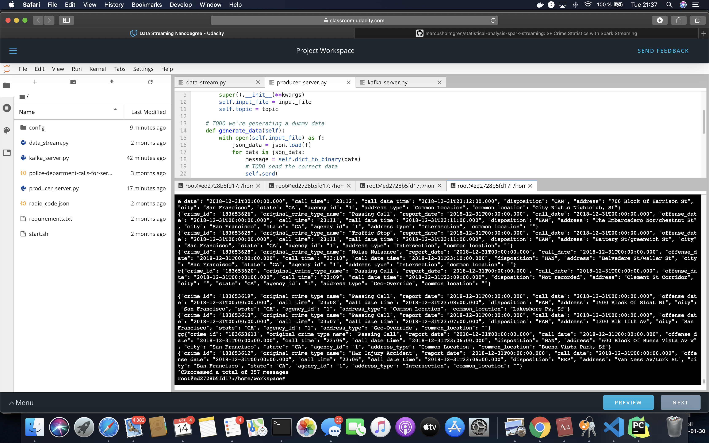
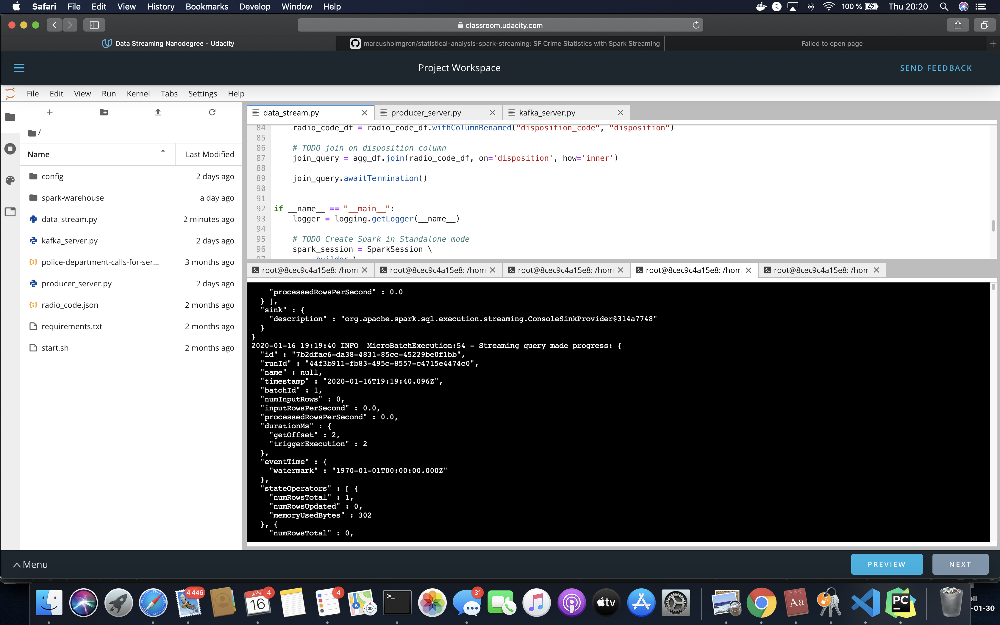

# SF Crime Statistics with Spark Streaming

Project 2 of the [Data Streaming](https://www.udacity.com/course/data-streaming-nanodegree--nd029) Nanodegree Program.

## Getting started

1. Install requirements using `./start.sh` if you use conda for Python. If you use pip rather than conda, then use `pip install -r requirements.txt`.

2. Navigate to the folder where you unzipped your Kafka download:
    * Begin with starting Zookeeper `bin/zookeeper-server-start.sh config/zookeeper.properties`
    * Then start Kafka server `bin/kafka-server-start.sh config/server.properties`

3. Start the bootstrap Kafka producer b `python kafka_server.py`

You can test the Kafka producer with the Kafka Console Reader

```cli
bin/kafka-console-consumer.sh --bootstrap-server localhost:9092 --topic mh.crime.report --from-beginning
```

4. Submit Spark job with command  
`spark-submit --packages org.apache.spark:spark-sql-kafka-0-10_2.11:2.3.4 --master local[*] data_stream.py`

### Udacity Data Streaming provided workspace instructions

The path to Zookeeper and Kafka is /usr/bin:
* `/usr/bin/zookeeper-server-start config/zookeeper.properties`
* `/usr/bin/kafka-server-start config/server.properties`

Running the Kafka Console Consumer in the Data Streaming provided workspace    
```cli
/usr/bin/kafka-console-consumer --bootstrap-server localhost:9092 --topic mh.crime.report --from-beginning
```

## Screenshots from step 2


## Answers to step 3 questions



No screenshot of the Spark Streaming UI as the streaming continues, because job was executed in the provided sandbox.

Zip-file with images in folder: [docs/two_images_no_sparkui.zip](docs/two_images_no_sparkui.zip)

Write the answers to these questions in the README.md doc of your GitHub repo:

### 1. How did changing values on the SparkSession property parameters affect the throughput and latency of the data?
When setting the `maxOffsetPerTrigger` to 1000 there where larger dumps of events processed.
But the where more delay when nothing was printed to the console.

### 1. What were the 2-3 most efficient SparkSession property key/value pairs? Through testing multiple variations on values, how can you tell these were the most optimal?
1. Without `kafka.bootstrap.servers` property Kafka streaming won't run, so it is important!
2. Either `subscribe` for a specific Kafka topic or `subscribePattern` for subscribing to a wildcard pattern is needed.
3. The `endingOffsets` with default value latest also worked out great.

When these properties where configured corretly with the Kafka IP address, port and Kafka topic the spark job could 
connect and process data.

Apache Spark [Structured Streaming + Kafka Integration Guide](https://spark.apache.org/docs/latest/structured-streaming-kafka-integration.html) documentation.

## Dependencies

[kafka-python](https://kafka-python.readthedocs.io)
